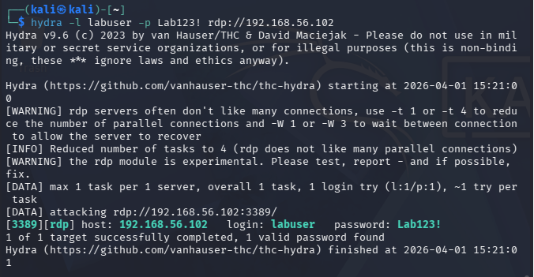
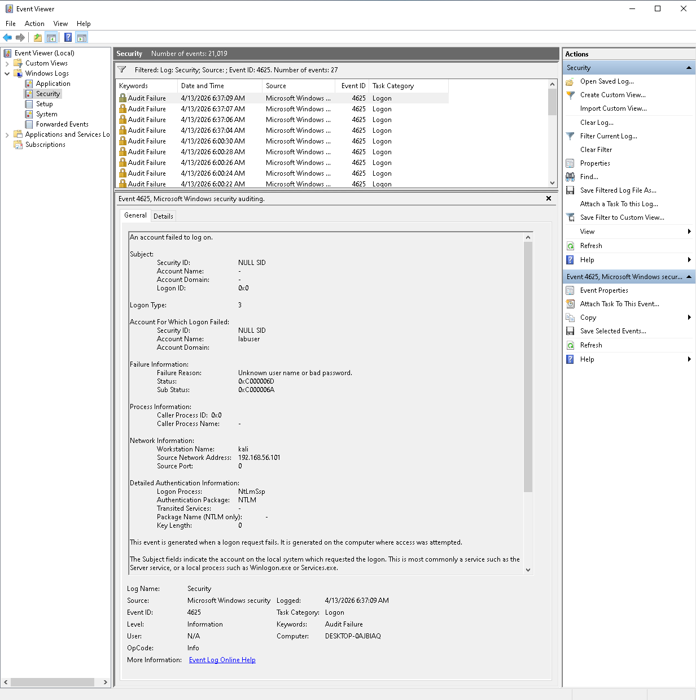
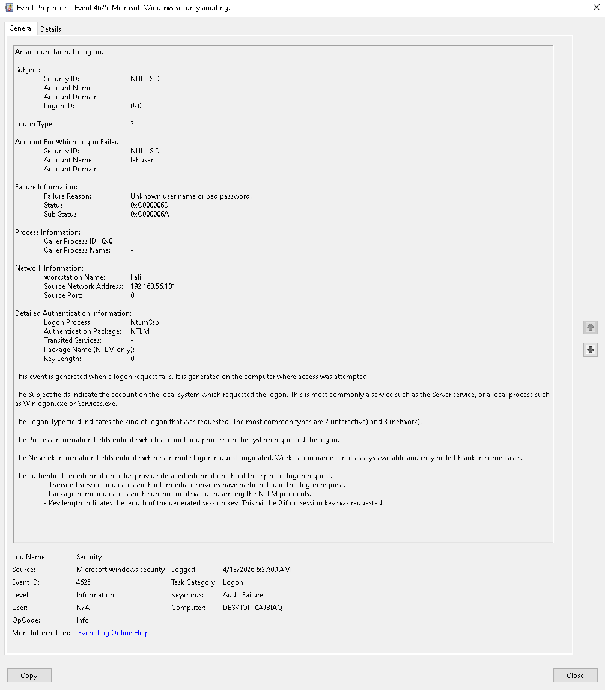
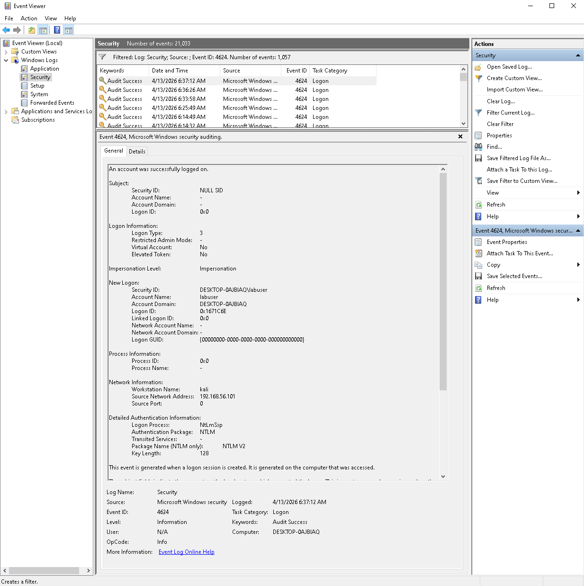
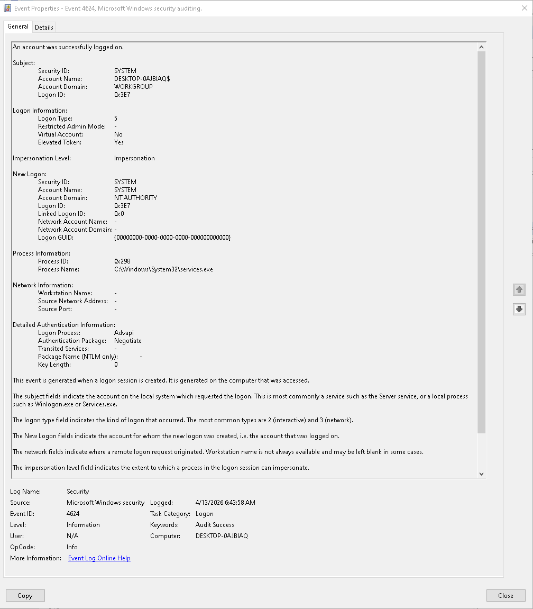

# 🚨 Brute Force Attack Detection

## 📌 Scenario

Simulated brute force attack on RDP service from Kali Linux using Hydra tool.

---

## ⚔️ Attack Simulation

* Tool: Hydra
* Target: Windows machine (RDP)
* Attacker IP: 192.168.56.101
* Victim IP: 192.168.56.102

---

## 📊 Logs Analysis

### Failed Logons (Event ID 4625)

Multiple failed login attempts detected from a single source IP.

Key indicators:

* Repeated authentication failures
* Same username attempts
* Short time interval between attempts

---

### Successful Logon (Event ID 4624)

After multiple failures, successful authentication occurred.

This indicates:
➡️ Possible password compromise

---

## 🧠 Detection Logic
Brute force attack is identified when:

- High number of Event ID 4625 from same IP
- Multiple failed logins within short timeframe (seconds/minutes)
- Followed by Event ID 4624 for the same account
- Logon Type 3 (network logon, typical for RDP attacks)

---

## 🔎 Investigation Findings

* Source IP: 192.168.56.101
* Target account: labuser
* Attack method: password brute force (Hydra)
* Outcome: successful login

---

## 🚨 Conclusion

Detected brute force attack leading to account compromise.

Recommended actions:

* Block source IP
* Reset compromised credentials
* Enable account lockout policy
* Monitor similar patterns

---

## 📸 Evidence

The screenshots below present evidence of the brute force attack and its successful detection.

### Brute Force Attack (Hydra)

### Failed Logins – Event ID 4625

### Failed Log Details

### Successful Logon – Event ID 4624

### Successful Log Details

---

## 💬 Interview Ready Statement

"I simulated a brute force attack using Hydra and detected it by correlating multiple failed logins (Event ID 4625) followed by a successful login (Event ID 4624), indicating a potential account compromise."
