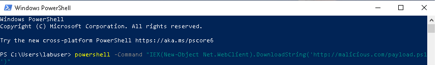
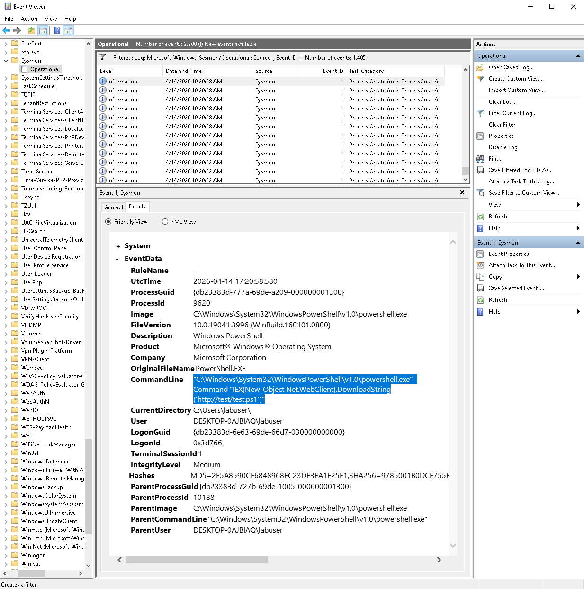

# ⚡ Suspicious PowerShell Activity Detection

Detection of suspicious PowerShell execution using Script Block Logging and Sysmon.

---

## 🎯 Objective

Detect execution of potentially malicious PowerShell commands indicating remote code execution or initial compromise.

---

## ⚔️ Attack Simulation

- Tool: PowerShell
- Victim: Windows

### Steps:

1. Execute suspicious PowerShell command
2. Command uses IEX / DownloadString
3. Remote script or payload is executed

---

## 📊 Logs Analysis

### PowerShell Event ID 4104 – Script Block Logging

- Full command execution captured
- Script content visibility

**Indicators:**
- `IEX`
- `DownloadString`
- External URL
- Encoded commands (-EncodedCommand)

---

### Sysmon Event ID 1 – Process Creation

- Process: `powershell.exe`
- Suspicious command-line arguments

**Why suspicious:**
PowerShell used to execute remote or obfuscated code

---

## 🚨 Detection Logic

Suspicious PowerShell activity is identified when:

- Event ID 4104 contains:
  - `IEX`
  - `DownloadString`
- External URL present
- Sysmon Event ID 1 shows suspicious command execution

---

## 🔎 Investigation Findings

- User: labuser
- Process: powershell.exe

**Indicators:**
- IEX execution  
- External URL  
- Potential payload execution  

**Outcome:**
Execution of remote PowerShell script

---

## 🧬 MITRE ATT&CK Mapping

- **T1059.001** – PowerShell  

---

## 🔎 Detection Queries (Splunk)

### Suspicious PowerShell

EventCode=4104 AND ("IEX" OR "DownloadString")

---

## 📸 Evidence

### PowerShell Execution

### Script Block Logging (Event ID 4104)

### Process Creation (Event ID 1)

---

## 🧠 Conclusion

Suspicious PowerShell activity detected using script block logging and process monitoring.

---

## 🚀 Key Takeaways

- PowerShell is commonly abused by attackers  
- Script Block Logging provides deep visibility  
- Detection should focus on behavior, not just keywords  

