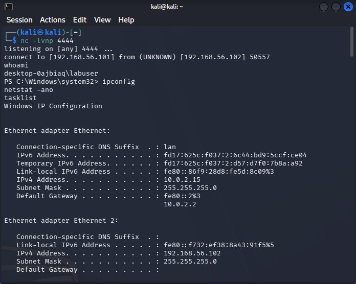
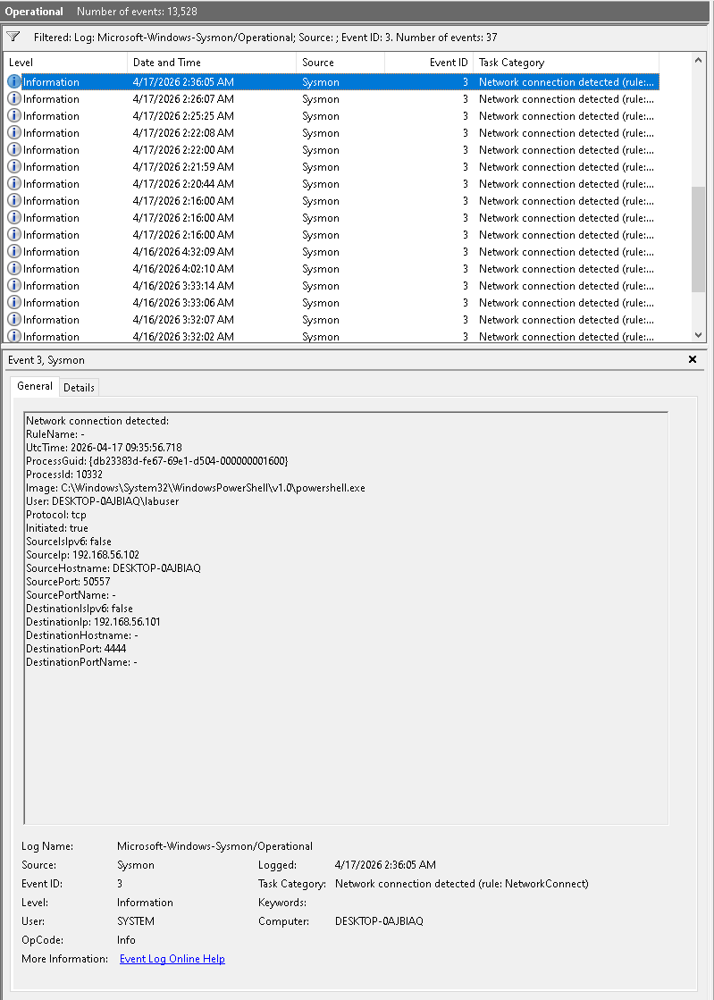
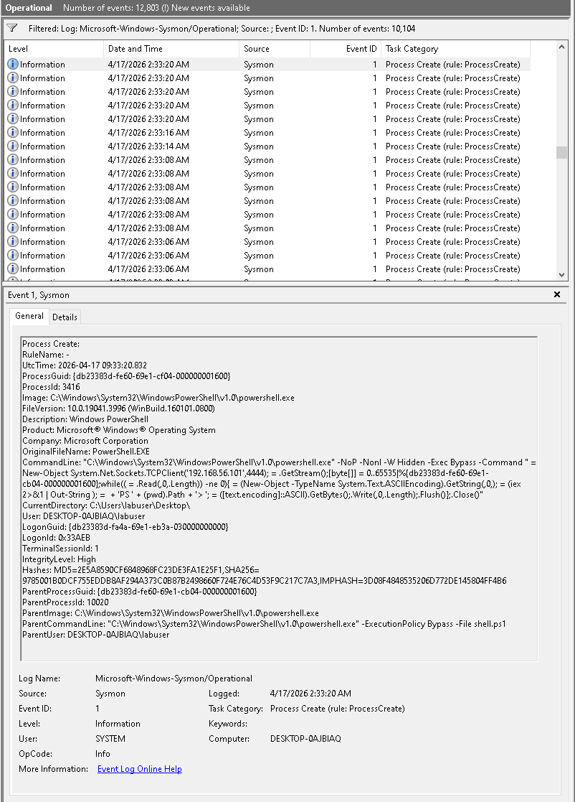
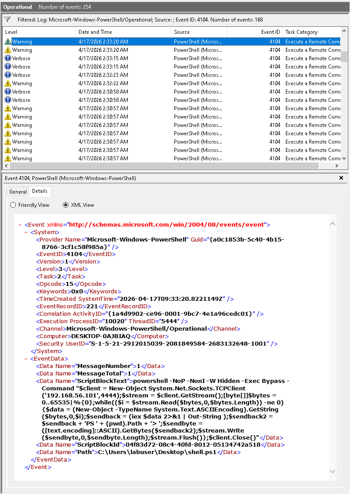

# 🔌 Reverse Shell Detection

Detection of reverse shell activity using PowerShell, Sysmon, and network correlation.

---

## 🎯 Objective

Simulate a reverse shell connection from a compromised Windows machine to an attacker and detect it using system logs.

---

## ⚔️ Attack Simulation

- Tool: PowerShell
- Attacker: Kali Linux
- Victim: Windows

### Steps:

1. Attacker starts listener: nc -lvnp 4444
2. Victim executes PowerShell reverse shell payload  
3. Outbound connection established  
4. Attacker gains remote shell  

---

## 📊 Logs Analysis

### Sysmon Event ID 1 – Process Creation

- Process: `powershell.exe`
- Suspicious flags:
  - `-NoP`
  - `-NonI`
  - `-W Hidden`
  - `-Exec Bypass`

---

### Sysmon Event ID 3 – Network Connection

- Source IP: victim  
- Destination IP: attacker  
- Destination Port: **4444**  
- Process: `powershell.exe`  

**Why suspicious:**
Outbound connection to uncommon port from PowerShell

---

### PowerShell Event ID 4104 – Script Block Logging

- Full reverse shell payload visible  

**Indicators:**
- `TCPClient`
- `IEX`
- Remote command execution  

---

## 🚨 Detection Logic

Reverse shell activity is identified when:

- PowerShell executed with suspicious flags  
- Event ID 4104 contains:
  - `IEX`
  - `TCPClient`
- Sysmon Event ID 3 shows outbound connection to unusual port  

---

## 🔎 Investigation Findings

- User: labuser  
- Process: powershell.exe  
- Destination: attacker machine  

**Indicators:**
- External connection  
- Suspicious PowerShell flags  
- Reverse shell payload  

**Outcome:**
Remote command execution achieved  

---

## 🧬 MITRE ATT&CK Mapping

- **T1059.001** – PowerShell  
- **T1071** – Application Layer Protocol (C2 communication)  

---

## 🔎 Detection Queries (Splunk)

### Reverse Shell (Network)

nc -lvnp 4444

### Suspicious PowerShell

EventCode=4104 AND ("IEX" OR "TCPClient")

---

## 📸 Evidence

### Reverse Shell Connection

### Network Connection (Event ID 3)

### PowerShell Process (Event ID 1)

### Script Block (Event ID 4104)

---

## 🧠 Conclusion

Reverse shell activity successfully detected through correlation of process execution and network behavior.

---

## 🚀 Key Takeaways

- Reverse shells create detectable outbound connections  
- Correlation between logs is critical  
- PowerShell logging reveals full attack chain  
